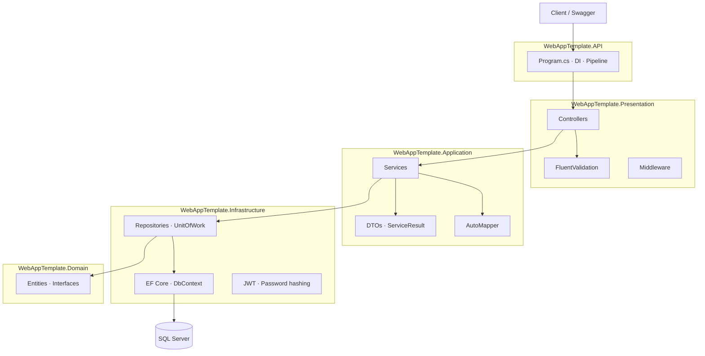

# WebAppTemplate

[](https://dotnet.microsoft.com/)
[](https://dotnet.microsoft.com/apps/aspnet)
[](LICENSE)

A production-oriented **ASP.NET Core 8 Web API template** built with **Clean Architecture**. Use it as a starting point for new backend projects or as a portfolio showcase for layered design, JWT authentication, EF Core, and Docker.

---

## Features

- **Clean Architecture** — API, Presentation, Application, Infrastructure, and Domain layers
- **JWT authentication** — sign-in, access tokens, and refresh token rotation
- **Role-based authorization** — protect endpoints with `[Authorize(Roles = "...")]`
- **EF Core 8 + SQL Server** — migrations, repositories, and Unit of Work
- **FluentValidation** — request validation on all POST endpoints
- **Consistent API responses** — unified `ApiResponse<T>` for success, validation, and service errors
- **Request / Response DTOs** — entities are not exposed directly from the API
- **AutoMapper** — inbound and outbound object mapping
- **Docker Compose** — run API and SQL Server together locally
- **Swagger / OpenAPI** — interactive API docs with JWT support

---

## Architecture



**Request flow**

```
HTTP Request → Controller → FluentValidation → Service → UnitOfWork → Repository → Database
                                    ↓
                         ServiceResult<T> → ApiResponse<T> → JSON Response
```

---

## Tech Stack

| Category | Technology |
|----------|------------|
| Runtime | .NET 8 |
| API | ASP.NET Core Web API |
| ORM | Entity Framework Core 8 |
| Database | SQL Server |
| Auth | JWT Bearer + BCrypt password hashing |
| Validation | FluentValidation |
| Mapping | AutoMapper |
| API Docs | Swagger (Swashbuckle) |
| Containers | Docker · Docker Compose |

---

## Getting Started

### Prerequisites

- [.NET 8 SDK](https://dotnet.microsoft.com/download)
- [Docker Desktop](https://www.docker.com/products/docker-desktop/) (optional, for containerized setup)
- SQL Server (via Docker or local instance)

### 1. Clone the repository

```bash
git clone https://github.com/YOUR_USERNAME/WebAppTemplate.git
cd WebAppTemplate
```

### 2. Configure application settings

Copy the example config and fill in your values:

```bash
cp WebAppTemplate.API/appsettings.example.json WebAppTemplate.API/appsettings.json
cp WebAppTemplate.API/appsettings.example.Development.json WebAppTemplate.API/appsettings.Development.json
```

| Setting | Description |
|---------|-------------|
| `ConnectionStrings:myConn` | SQL Server connection string |
| `JwtSettings:Secret` | Signing key — **minimum 32 characters** |
| `JwtSettings:Issuer` | Token issuer |
| `JwtSettings:Audience` | Token audience |
| `JwtSettings:ExpirationMinutes` | Access token lifetime |

> `appsettings.json` is git-ignored. Never commit real secrets. Use `appsettings.example.json` as the public template.

### 3. Start SQL Server (Docker)

```bash
docker compose up -d sqlserver
```

| Context | Server value |
|---------|----------------|
| Host machine / SSMS / EF migrations | `localhost,1433` |
| API running inside Docker | `sqlserver,1433` |

The API service in `docker-compose.yml` already overrides the connection string for the container network.

### 4. Apply database migrations

From the solution root:

```bash
dotnet ef database update --project WebAppTemplate.Infrastructure --startup-project WebAppTemplate.API
```

Install the EF CLI tool if needed:

```bash
dotnet tool install --global dotnet-ef
```

### 5. Run the API

**Option A — Local (recommended for development)**

```bash
dotnet run --project WebAppTemplate.API
```

Open Swagger: [http://localhost:5083/swagger](http://localhost:5083/swagger)

**Option B — Docker (API + SQL Server)**

```bash
docker compose up --build -d
```

Open Swagger: [http://localhost:5000/swagger](http://localhost:5000/swagger)

---

## API Endpoints

### Account (public)

| Method | Endpoint | Description |
|--------|----------|-------------|
| `POST` | `/api/account/register` | Register a new user |
| `POST` | `/api/account/sign-in` | Sign in and receive JWT + refresh token |
| `POST` | `/api/account/refresh-token` | Exchange a valid refresh token for new tokens |

### User management (authenticated)

| Method | Endpoint | Auth | Description |
|--------|----------|------|-------------|
| `POST` | `/api/user/create-role` | JWT | Create a new role |
| `POST` | `/api/user/create-role-assignment` | JWT | Assign a role to a user |
| `GET` | `/api/user/users` | JWT + `Administrator` role | List active users |

### Using JWT in Swagger

1. Call `POST /api/account/sign-in`
2. Copy the `accessToken` from the response `data` object
3. Click **Authorize** in Swagger
4. Enter: `Bearer <your-token>`

> Role names in JWT claims come from the `Roles` table (`RoleName`). The `Administrator` role is required for `GET /api/user/users`.

---

## API Response Format

All successful and failed service responses use the same envelope:

**Success**

```json
{
  "success": true,
  "message": "Opeation Successfull",
  "data": { }
}
```

**Validation / business error**

```json
{
  "success": false,
  "message": "Email is required., Password is required.",
  "data": null
}
```

FluentValidation errors and `ServiceResult` failures both return this shape.

---

## Project Structure

```
WebAppTemplate/
├── WebAppTemplate.API/              # Entry point, Program.cs, Swagger, Docker
├── WebAppTemplate.Presentation/     # Controllers, validators, middleware
├── WebAppTemplate.Application/      # Services, DTOs, ServiceResult, AutoMapper
├── WebAppTemplate.Infrastructure/   # EF Core, repositories, JWT, persistence
├── WebAppTemplate.Domain/           # Entities, enums, repository interfaces
├── docs/
│   └── TASKS.md                     # Roadmap and next steps
├── docker-compose.yml
└── WebAppTemplate.sln
```

### Layer responsibilities

| Layer | Responsibility |
|-------|----------------|
| **API** | App host, configuration, dependency injection wiring |
| **Presentation** | HTTP controllers, FluentValidation, API-specific middleware |
| **Application** | Business logic, DTOs, `ServiceResult<T>`, service interfaces |
| **Infrastructure** | Database access, authentication implementation, external concerns |
| **Domain** | Core entities and abstractions — no framework dependencies |

---

## Configuration Files

| File | Purpose | Committed to git |
|------|---------|------------------|
| `appsettings.example.json` | Public config template | Yes |
| `appsettings.example.Development.json` | Dev overrides template | Yes |
| `appsettings.Test.json` | Test environment template | Yes |
| `appsettings.json` | Local secrets and connection strings | No |
| `appsettings.Development.json` | Local dev overrides | No |

---

## Docker Services

| Service | Image / Build | Port |
|---------|---------------|------|
| `api` | `WebAppTemplate.API/Dockerfile` | `5000 → 8080` |
| `sqlserver` | `mcr.microsoft.com/mssql/server:2022-latest` | `1433` |

```bash
# Start everything
docker compose up --build -d

# Stop
docker compose down

# View logs
docker compose logs -f api
```

---

## Roadmap

Planned improvements for this template:

- Database seed data (default roles and admin user)
- Global exception handling middleware
- Health check endpoint (`/health`)
- Account APIs: logout, `/me`, change-password
- Pagination for user listing
- Unit and integration tests
- GitHub Actions CI

See the full checklist in [`docs/TASKS.md`](docs/TASKS.md).

---

## Contributing

1. Fork the repository
2. Create a feature branch (`git checkout -b feature/my-feature`)
3. Commit your changes
4. Open a pull request

---

## License

This project is licensed under the MIT License — see the [LICENSE](LICENSE) file for details.

---

## Author

**Bilal Khan**

If this template helped you, consider giving the repo a star on GitHub.
