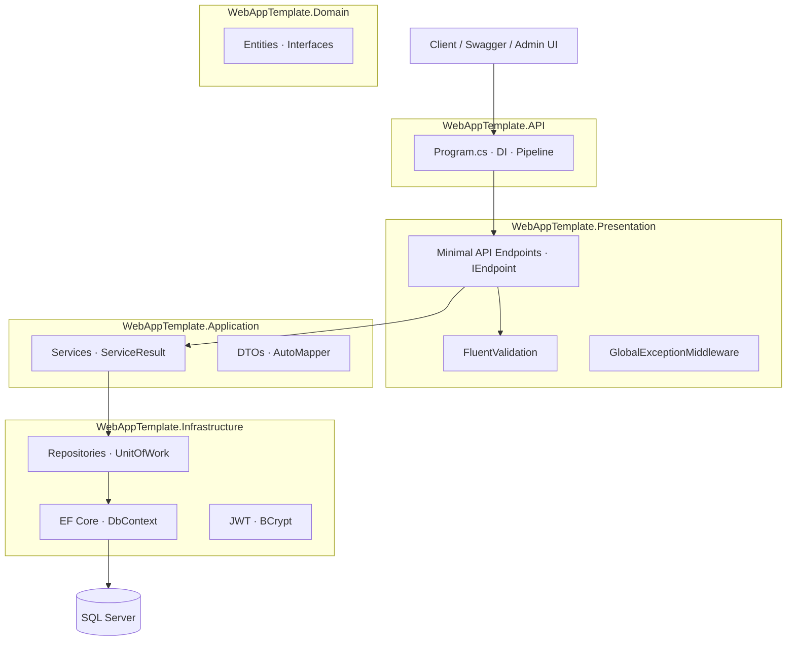

# WebAppTemplate

[](https://github.com/bilalkhan190/WebAppTemplate/actions/workflows/ci.yml)
[](https://dotnet.microsoft.com/)
[](https://dotnet.microsoft.com/apps/aspnet)
[](LICENSE)

A production-oriented **ASP.NET Core 8 Web API template** built with **Clean Architecture**. Use it as a starting point for new backend projects or as a portfolio showcase for layered design, JWT authentication, RBAC, EF Core, and Docker.

---

## Features

- **Clean Architecture** — API, Presentation, Application, Infrastructure, and Domain layers
- **Minimal APIs** — endpoint classes implementing `IEndpoint` (not MVC controllers)
- **JWT authentication** — sign-in, access tokens, refresh token rotation, logout
- **Role + permission authorization** — role claims and permission policies on protected endpoints
- **Platform RBAC section** — `/api/Platform/*` for roles, permissions, and assignments
- **EF Core 8 + SQL Server** — migrations, repositories, Unit of Work, seed data
- **FluentValidation** — request validation on POST/PUT endpoints and paginated GET
- **Consistent API responses** — unified `ApiResponse<T>` envelope
- **Global exception handling** — same response shape; no stack traces in production
- **Health check** — `GET /health` with SQL Server connectivity (non-test environments)
- **Docker Compose** — API + SQL Server with persistent volume and `.env` secrets
- **Swagger / OpenAPI** — enabled in Development and Docker (not in Production)
- **Tests** — unit tests (Application) + integration tests (`WebApplicationFactory`)
- **Demo admin UI** — static page at `/admin` for sign-in and user listing

---

## Architecture



**Request flow**

```
HTTP Request → IEndpoint → FluentValidation → Service → UnitOfWork → Repository → Database
                                    ↓
                         ServiceResult<T> → ApiResponse<T> → JSON Response
```

---

## Tech Stack

| Category | Technology |
|----------|------------|
| Runtime | .NET 8 |
| API | ASP.NET Core Minimal APIs |
| ORM | Entity Framework Core 8 |
| Database | SQL Server |
| Auth | JWT Bearer + BCrypt |
| Authorization | Roles + permission claims/policies |
| Validation | FluentValidation |
| Mapping | AutoMapper |
| API Docs | Swagger (Swashbuckle) |
| Testing | xUnit, FluentAssertions, Moq, WebApplicationFactory |
| Containers | Docker · Docker Compose |

---

## Getting Started

### Prerequisites

- [.NET 8 SDK](https://dotnet.microsoft.com/download)
- [Docker Desktop](https://www.docker.com/products/docker-desktop/) (optional)
- SQL Server (via Docker or local instance)

### 1. Clone the repository

```bash
git clone https://github.com/bilalkhan190/WebAppTemplate.git
cd WebAppTemplate
```

### 2. Configure application settings

```bash
cp WebAppTemplate.API/appsettings.example.json WebAppTemplate.API/appsettings.json
cp WebAppTemplate.API/appsettings.example.Development.json WebAppTemplate.API/appsettings.Development.json
```

| Setting | Description |
|---------|-------------|
| `ConnectionStrings:myConn` | SQL Server connection string |
| `JwtSettings:Secret` | Signing key — **minimum 32 characters** |
| `JwtSettings:Issuer` | Token issuer |
| `JwtSettings:Audience` | Token audience |
| `JwtSettings:ExpirationMinutes` | Access token lifetime |

> `appsettings.json` is git-ignored. Never commit real secrets.

### 3. Docker setup (optional)

```bash
cp .env.example .env
# Edit .env and set MSSQL_SA_PASSWORD
docker compose up -d sqlserver
```

| Context | Server value |
|---------|----------------|
| Host machine / EF migrations | `localhost,1433` |
| API running inside Docker | `sqlserver,1433` |

### 4. Apply database migrations

```bash
dotnet ef database update --project WebAppTemplate.Infrastructure --startup-project WebAppTemplate.API
```

### 5. Run the API

**Local development**

```bash
dotnet run --project WebAppTemplate.API
```

- Swagger: [http://localhost:5083/swagger](http://localhost:5083/swagger)
- Admin UI: [http://localhost:5083/admin](http://localhost:5083/admin)

**Docker (API + SQL Server)**

```bash
docker compose up --build -d
```

- Swagger: [http://localhost:5000/swagger](http://localhost:5000/swagger)

### Default seeded credentials (development)

| Field | Value |
|-------|-------|
| Username | `admin` |
| Password | `Admin@123` |
| Role | `Administrator` |

> Development only. Change credentials before production.

---

## API Endpoints

### Account

| Method | Endpoint | Auth | Description |
|--------|----------|------|-------------|
| `POST` | `/api/Account/register` | Public | Register a new user |
| `POST` | `/api/Account/sign-in` | Public | Sign in — returns JWT + refresh token |
| `POST` | `/api/Account/refresh-token` | Public | Refresh access token |
| `POST` | `/api/Account/logout` | JWT | Revoke refresh token |
| `GET` | `/api/Account/me` | JWT | Current user profile |
| `POST` | `/api/Account/change-password` | JWT | Change password |

### User management

| Method | Endpoint | Auth | Description |
|--------|----------|------|-------------|
| `GET` | `/api/User/users?pageNumber=1&pageSize=10` | JWT + policy | Paginated active users |
| `GET` | `/api/User/users/{id}` | JWT + policy | User by ID |
| `PUT` | `/api/User/users/{id}` | JWT + policy | Update user |
| `DELETE` | `/api/User/users/{id}` | JWT + policy | Soft delete user |

### Platform (RBAC)

| Method | Endpoint | Auth | Description |
|--------|----------|------|-------------|
| `POST` | `/api/Platform/roles` | JWT + policy | Create role |
| `GET` | `/api/Platform/roles` | JWT + policy | List roles |
| `POST` | `/api/Platform/permissions` | JWT + policy | Create permission |
| `GET` | `/api/Platform/permissions` | JWT + policy | List permissions |
| `POST` | `/api/Platform/role-permissions` | JWT + policy | Assign permissions to role |
| `POST` | `/api/Platform/user-roles` | JWT + policy | Assign role to user |

### Infrastructure

| Method | Endpoint | Auth | Description |
|--------|----------|------|-------------|
| `GET` | `/health` | Public | Health check |

**Authorization policies:** `Administrator` role bypasses permission checks. Other users need permission claims (e.g. `users.read`, `users.manage`) embedded in the JWT from role-permission assignments.

### Using JWT in Swagger

1. Call `POST /api/Account/sign-in`
2. Copy `accessToken` from the response `data` object
3. Click **Authorize** in Swagger
4. Enter: `Bearer <your-token>`

---

## API Response Format

**Success**

```json
{
  "success": true,
  "message": "Operation Successful",
  "data": { }
}
```

**Validation / business error**

```json
{
  "success": false,
  "message": "Email is required., Password is required.",
  "data": null
}
```

---

## Testing

```bash
dotnet test
```

| Project | Scope |
|---------|-------|
| `WebAppTemplate.Application.Tests` | Unit tests for `AuthService`, `UserService` |
| `WebAppTemplate.IntegrationTests` | API tests via `WebApplicationFactory` |

---

## Project Structure

```
WebAppTemplate/
├── WebAppTemplate.API/              # Host, Program.cs, Swagger, Docker, wwwroot/admin
├── WebAppTemplate.Presentation/     # Minimal API endpoints, validators, middleware
├── WebAppTemplate.Application/      # Services, DTOs, ServiceResult, AutoMapper
├── WebAppTemplate.Infrastructure/     # EF Core, repositories, JWT, seeding
├── WebAppTemplate.Domain/             # Entities, enums, repository interfaces
├── WebAppTemplate.Application.Tests/
├── WebAppTemplate.IntegrationTests/
├── .github/workflows/ci.yml
├── docs/TASKS.md
└── docker-compose.yml
```

---

## Docker Services

| Service | Image / Build | Port |
|---------|---------------|------|
| `api` | `WebAppTemplate.API/Dockerfile` | `5000 → 8080` |
| `sqlserver` | `mcr.microsoft.com/mssql/server:2022-latest` | `1433` |

```bash
docker compose up --build -d
docker compose down
docker compose logs -f api
```

Copy `.env.example` to `.env` before starting Docker. Never commit `.env`.

---

## GitHub Showcase — Repository Setup

Repo code-wise showcase-ready hai. GitHub par ye settings configure karo taake profile/recruiters ke liye professional lage.

### 1. Push latest code

```bash
git push origin main
```

> Local `main` par latest commit ho to pehle push karo — CI badge tabhi green dikhega.

### 2. Repository visibility

| Setting | Value |
|---------|-------|
| **Visibility** | **Public** (portfolio ke liye zaroori) |

GitHub → repo → **Settings** → **General** → Danger Zone → *Change visibility* → Public

### 3. About section (repo homepage par dikhta hai)

Repo page par **⚙️ About** (right side) → **Edit**:

| Field | Suggested value |
|-------|-----------------|
| **Description** | Production-ready ASP.NET Core 8 Web API template — Clean Architecture, JWT, RBAC, EF Core, Docker |
| **Website** | (optional) LinkedIn ya portfolio URL |
| **Topics** | `aspnet-core`, `clean-architecture`, `jwt-authentication`, `dotnet8`, `web-api`, `entity-framework-core`, `minimal-api`, `docker`, `csharp`, `template` |

### 4. Template repository (recommended)

**Settings** → **General** → **Template repository** → ✅ **Enable**

Is se doosre log *Use this template* se naya repo bana sakte hain — template projects ke liye standard practice hai.

### 5. Default branch

**Settings** → **General** → **Default branch** → `main`

### 6. Actions / CI

**Settings** → **Actions** → **General** → *Workflow permissions*:

- ✅ Read and write permissions (default theek hai)
- Actions enabled hon

Push ke baad **Actions** tab check karo — CI green hona chahiye.

### 7. Social preview (optional but strong)

**Settings** → scroll to **Social preview** → image upload karo (1280×640):

- Swagger screenshot, ya architecture diagram
- Recruiters ko link share karte waqt professional card dikhega

### 8. Pin repository (profile par)

Apne GitHub profile → **Customize your pins** → `WebAppTemplate` pin karo.

### 9. Profile README (optional)

Agar `bilalkhan190/bilalkhan190` profile README hai to usme is repo ka link + 1 line description add karo.

### Showcase readiness checklist

| Item | Status |
|------|--------|
| README with badges, setup, endpoints | ✅ |
| LICENSE (MIT) | ✅ |
| CONTRIBUTING.md | ✅ |
| `.github/workflows/ci.yml` | ✅ |
| Unit + integration tests | ✅ |
| `appsettings.example.json` (no secrets in git) | ✅ |
| Docker `.env.example` | ✅ |
| Swagger + `/admin` demo | ✅ |
| Social preview image | ⬜ optional |
| Template repository enabled | ⬜ manual |
| Repo pinned on profile | ⬜ manual |

---

## Roadmap

See [`docs/TASKS.md`](docs/TASKS.md) for the full checklist. Optional next steps:

- API versioning
- Rate limiting on auth endpoints
- Serilog structured logging
- Email verification / password reset

---

## Contributing

See [CONTRIBUTING.md](CONTRIBUTING.md).

---

## License

MIT — see [LICENSE](LICENSE).

---

## Author

**Bilal Khan**

- Repository: [github.com/bilalkhan190/WebAppTemplate](https://github.com/bilalkhan190/WebAppTemplate)
- If this template helped you, consider giving the repo a **star** on GitHub.
